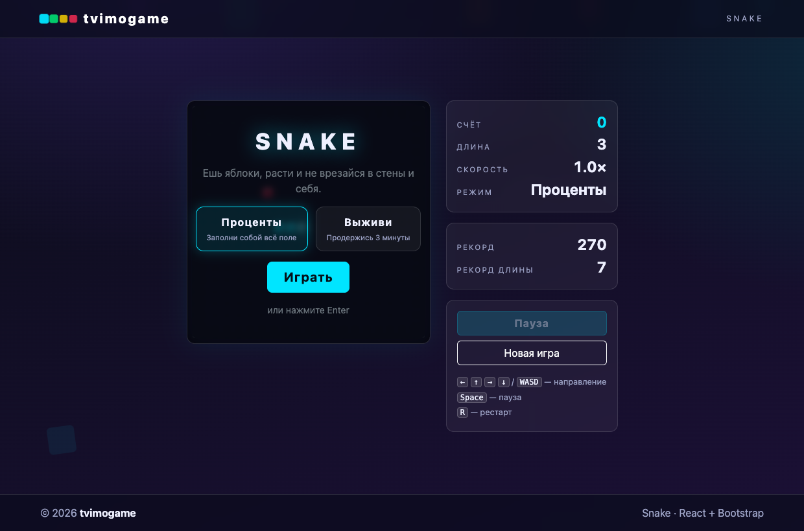
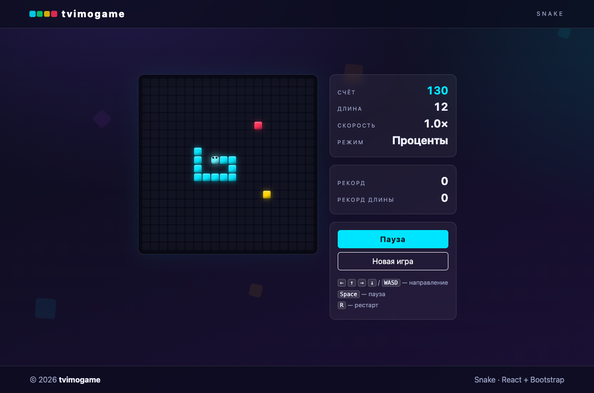
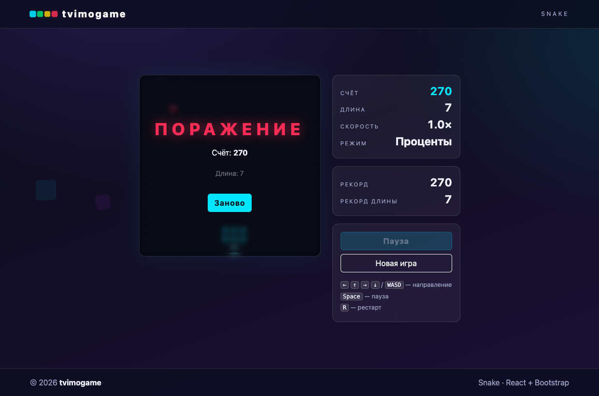

# Snake (Змейка) — tvimogame

Браузерная игра «Змейка» в едином визуальном стиле платформы tvimogame (как и другие игры линейки).

**Играй прямо сейчас:** https://tvimogame.github.io/snakes/

- Старт: выбор режима — **«Проценты»** (заполни всё поле) или **«Выживи»** (продержись 3 минуты при нарастающей скорости).
- Управление: **стрелки / WASD** — направление, **Space** — пауза, **R** — рестарт. Поворот на 180° запрещён.
- Яблоко: +10 очков, змейка растёт.
- Бонусы (жёлтое яблоко ×2 очки на 15 с, «стройность» −3 клетки, ускорение +50).
- Дебаффы (яд −50 очков и +2 клетки, «паня» — скорость вдвое на 5 с).
- Скорость растёт каждые 30 секунд. Счёт и длина сохраняются в `localStorage`.

## Скриншоты

| Стартовый экран | Игровой процесс | Поражение |
| --- | --- | --- |
|  |  |  |

## Разработка

- `npm run dev` — dev-сервер Vite (HMR).
- `npm run lint` — oxlint.
- `npm run build` — продакшен-сборка.
- `npm run preview` — предпросмотр сборки.

## Тесты

E2E на Playwright (запускаются против `npm run preview`):

- `npx playwright test` — весь набор: старт, движение, повороты и запрет 180°,
  еда (счёт/длина), каждый бонус и дебафф, пауза, рестарт,
  столкновения (стена/тело), победа в обоих режимах, ускорение, рекорд.
- `npx playwright test --ui` — UI-режим.

Стек: React + Vite, Bootstrap 5, Playwright. Чистая игровая логика в
`src/game/snake.js`, хук-обёртка — `src/hooks/useSnake.js`, рендер —
компоненты в `src/components/`.
